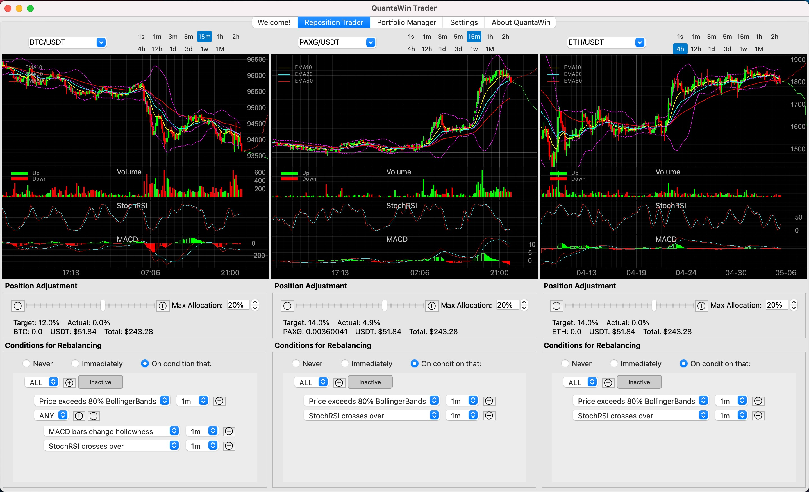
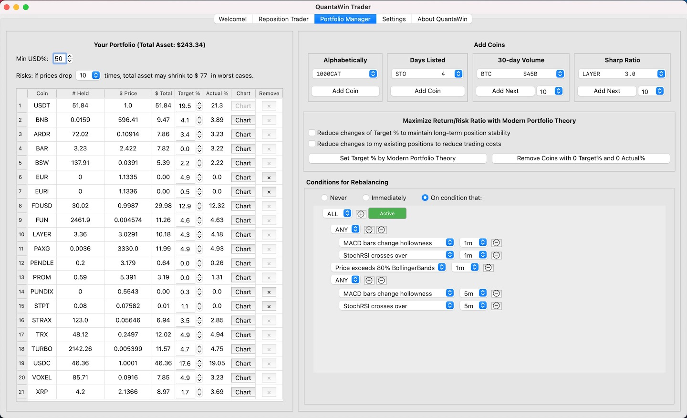

# QuantaWin Trader

🚀 **Precision Crypto Portfolio Management — Simplified. Powered by Math.**

QuantaWin Trader is your intelligent crypto trading assistant automated trading and portfolio rebalancing on Binance, combining modern portfolio theory, algorithmic logic, and real-world practicality into a robust desktop application.

---

## 🔍 What Makes QuantaWin Trader Revolutionary?

**Trade with Purpose — Not Emotion**

Set your **target portfolio allocations**, define logical **trading conditions**, and let QuantaWin Trader do the rest.

✅ Executes **cost-efficient, small rebalancing orders**  
✅ Designed to **minimize slippage and trading fees**  
✅ Built for **strategic thinkers**, not gamblers

---

## 🎯 Features at a Glance

### 🔁 Reposition Trader
- Adjust positions manually with one click
- Designed for **quick tactical moves**
- View and trade **three pairs simultaneously**

### 📊 Portfolio Manager
- See **actual vs. target** coin allocations
- **Forecast stress scenarios and losses**
- Apply **Modern Portfolio Theory** for optimal allocation
- Smart auto-interest allocation via **Binance Simple Earn**

### ⚙️ Trading Tools Widget
- Build **custom conditional trading rules**
- Use popular technical indicators
- Fully visual and **no coding required**

---

## 🧠 Built on Sound Principles

- **Modern Portfolio Theory (MPT)** – Maximize return-to-volatility
- **Kelly Criterion** – Grow capital through optimal position sizing
- **Spot-Only** – No leverage, margin, or futures
- **Passive-Compatible** – Works even when you're away

---

## 🛡️ Risk-Aware by Design

- 🔥 Simulate crash scenarios to plan worst-case outcomes
- 🧯 Use stablecoins for passive yield and crash-buying readiness
- 🧘 Stay calm: strategy is built to **buy low, sell high**

---

## 💡 Suggested Position Sizes

- 🏦 Bank-financed accounts: Crypto exposure ≤ **20%**
- 🔥 High-risk profile: Crypto exposure ≤ **40%**
- 💰 Keep **60%+ in stablecoins** to earn and defend

> **QuantaWin Trader is not a gambling tool.**  
> **Start with strategy. Trade with safety. Profit with peace of mind.**

---

## ✅ Get Started

- Launch **Reposition Trader** for individual trades
- Open **Portfolio Manager** to manage long-term allocations

---

## 📦 Downloads

Visit the [Releases](https://github.com/QuantaWin/QuantaWinTrader/releases) page to download compiled versions for:

- **Windows**
- **macOS**

---

## 🛠️ Requirements

- A Binance account with trading API access  
- No installation needed — just extract and run

---

## 🔒 Your Keys, Your Control

- API keys are **AES-encrypted**, stored **locally only**
- Encryption is tied to your device fingerprint
- Optional password-based protection available
- QuantaWin Trader does not connect to any external server other than Binance and your proxy servers

---

**Disclaimer**: this program is provided as what it is without any guarantee. We are not responsible for any technical problem or investment loss if you use it.

© QuantaWin Trader. All rights reserved.
